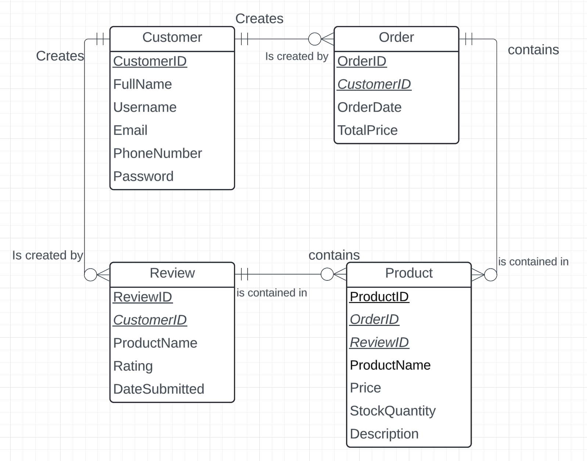
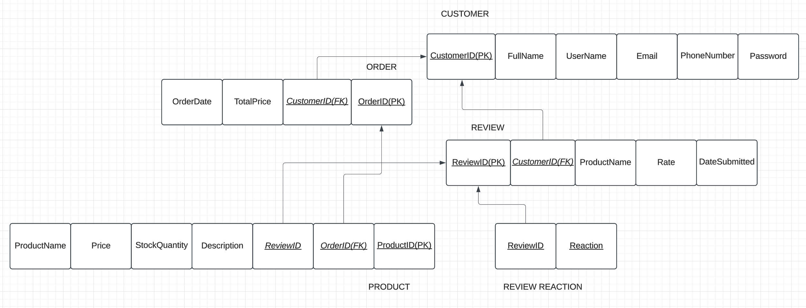
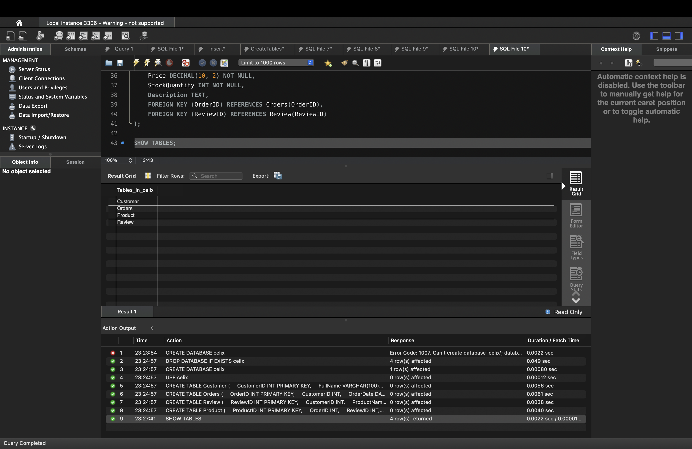
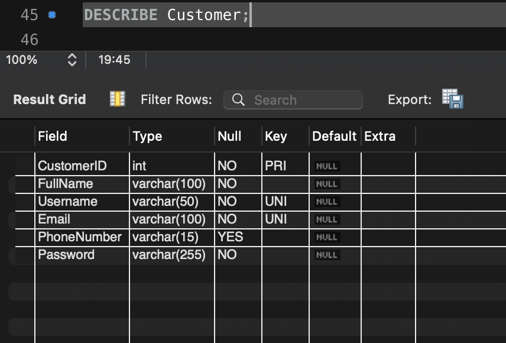
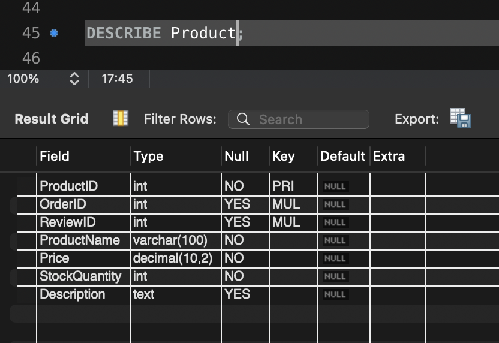
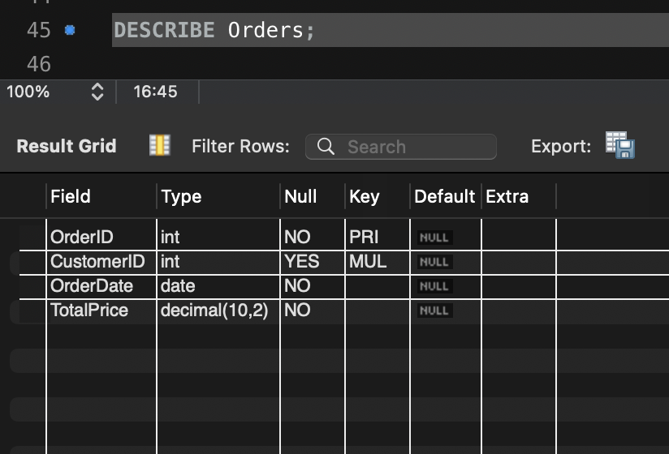
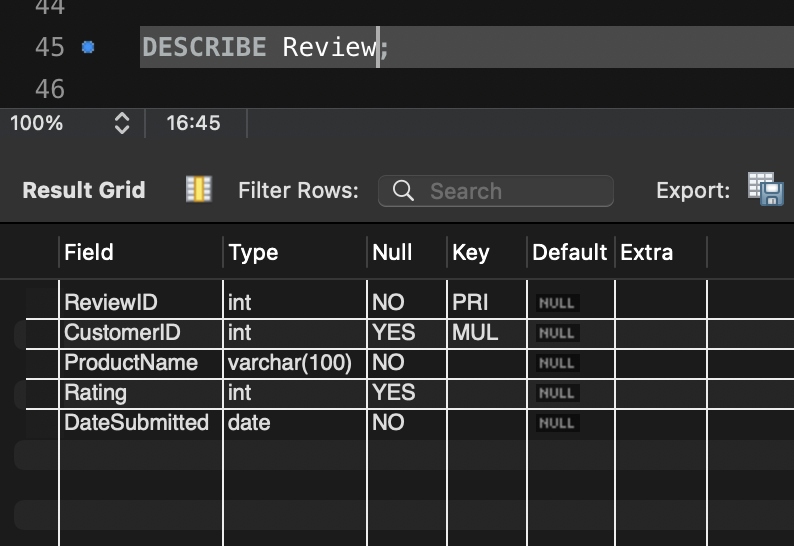

# CELIX

This project is a database design for CELIX Technologies, which includes an Entity-Relationship Diagram to outline relationships among key data entities.

Entity-Relationship Diagram:

ERD Relations:

## Database Structure

After executing the SQL code, the following tables will be created in the `celix` database:

- **Customer**: Stores information about customers, including their ID, full name, username, email, phone number, and password.
- **Order**: Contains details about customer orders, including the order ID, customer ID, order date, and total price.
- **Review**: Holds customer reviews for products, including the review ID, customer ID, product name, rating, and submission date.
- **Product**: Maintains product information, including product ID, order ID, review ID, product name, price, stock quantity, and description.

# CELIX Database Screenshots from MySQL

Table: 

Customer:

Product:

Order:

Review:

# CELIX Database Setup for SQL

CREATE DATABASE celix;

USE celix;

CREATE TABLE Customer (
    CustomerID INT PRIMARY KEY,
    FullName VARCHAR(100) NOT NULL,
    Username VARCHAR(50) UNIQUE NOT NULL,
    Email VARCHAR(100) UNIQUE NOT NULL,
    PhoneNumber VARCHAR(15),
    Password VARCHAR(255) NOT NULL
);

CREATE TABLE Orders (
    OrderID INT PRIMARY KEY,
    CustomerID INT,
    OrderDate DATE NOT NULL,
    TotalPrice DECIMAL(10, 2) NOT NULL,
    FOREIGN KEY (CustomerID) REFERENCES Customer(CustomerID)
);

CREATE TABLE Review (
    ReviewID INT PRIMARY KEY,
    CustomerID INT,
    ProductName VARCHAR(100) NOT NULL,
    Rating INT CHECK (Rating BETWEEN 1 AND 5),
    DateSubmitted DATE NOT NULL,
    FOREIGN KEY (CustomerID) REFERENCES Customer(CustomerID)
);

CREATE TABLE Product (
    ProductID INT PRIMARY KEY,
    OrderID INT,
    ReviewID INT,
    ProductName VARCHAR(100) NOT NULL,
    Price DECIMAL(10, 2) NOT NULL,
    StockQuantity INT NOT NULL,
    Description TEXT,
    FOREIGN KEY (OrderID) REFERENCES Orders(OrderID),
    FOREIGN KEY (ReviewID) REFERENCES Review(ReviewID)
);

SHOW TABLES;

