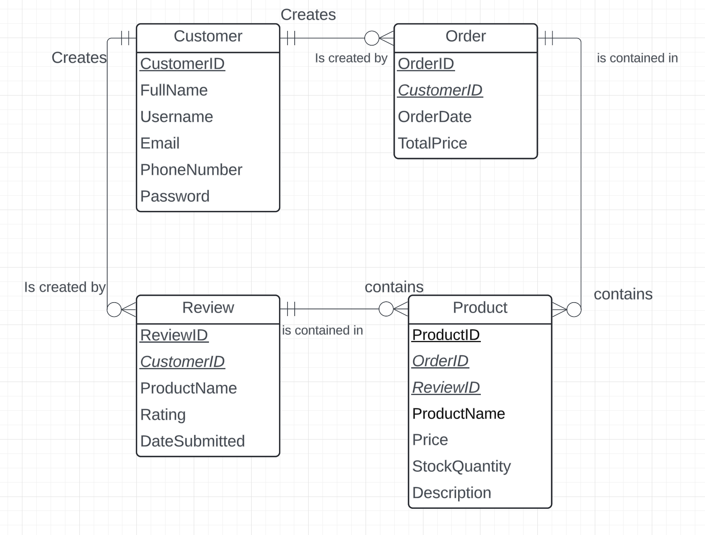

# CELIX

This project is a database design for CELIX Technologies, which includes an Entity-Relationship Diagram to outline relationships among key data entities.

Entity-Relationship Diagram:

## Database Structure

After executing the SQL code, the following tables will be created in the `celix` database:

- **Customer**: Stores information about customers, including their ID, full name, username, email, phone number, and password.
- **Order**: Contains details about customer orders, including the order ID, customer ID, order date, and total price.
- **Review**: Holds customer reviews for products, including the review ID, customer ID, product name, rating, and submission date.
- **Product**: Maintains product information, including product ID, order ID, review ID, product name, price, stock quantity, and description.

# CELIX Database Setup for SQL

CREATE DATABASE celix;

USE celix;

CREATE TABLE Customer (
    CustomerID INT PRIMARY KEY AUTO_INCREMENT,
    FullName VARCHAR(255),
    Username VARCHAR(50),
    Email VARCHAR(255),
    PhoneNumber VARCHAR(15),
    Password VARCHAR(255)
);

CREATE TABLE `Order` (
    OrderID INT PRIMARY KEY AUTO_INCREMENT,
    CustomerID INT,
    OrderDate DATE,
    TotalPrice DECIMAL(10, 2),
    FOREIGN KEY (CustomerID) REFERENCES Customer(CustomerID) ON DELETE CASCADE
);

CREATE TABLE Product (
    ProductID INT PRIMARY KEY AUTO_INCREMENT,
    OrderID INT,
    ReviewID INT,
    ProductName VARCHAR(255),
    Price DECIMAL(10, 2),
    StockQuantity INT,
    Description TEXT,
    FOREIGN KEY (OrderID) REFERENCES `Order`(OrderID) ON DELETE SET NULL,
    FOREIGN KEY (ReviewID) REFERENCES Review(ReviewID) ON DELETE SET NULL
);

CREATE TABLE Review (
    ReviewID INT PRIMARY KEY AUTO_INCREMENT,
    CustomerID INT,
    ProductName VARCHAR(255),
    Rating INT CHECK (Rating BETWEEN 1 AND 5),
    DateSubmitted DATE,
    FOREIGN KEY (CustomerID) REFERENCES Customer(CustomerID) ON DELETE CASCADE
);

